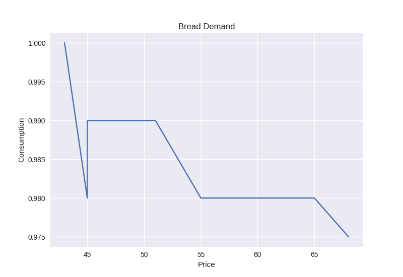
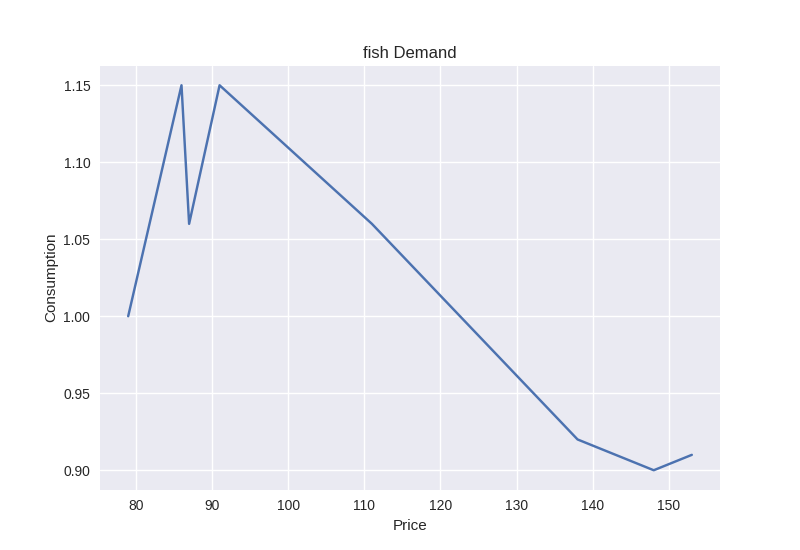

# Спрос на товары

{ height=256px }

{ height=256px }

# Эластичность

- Эластичность хлеба $= 0.06$
- Эластичность рыбы $= 0.38$

# Выводы

- цена на хлеб растёт, спрос практически не меняется, поэтому можно флуктуации цены не повлияют на продажи
- люди очень чувствительны к цене на рыбу, т.к. она не является товаром первой необходимости; можно бороться за клиента ценой

# Неподчинение закону Госсена

- коллекционер хочет иметь завершающие коллекцию произведения сильнее, чем первые предметы коллекции
- человеку нужна вторая перчатка к первой больше, чем первая перчатка в ситуации отсутствия перчаток
