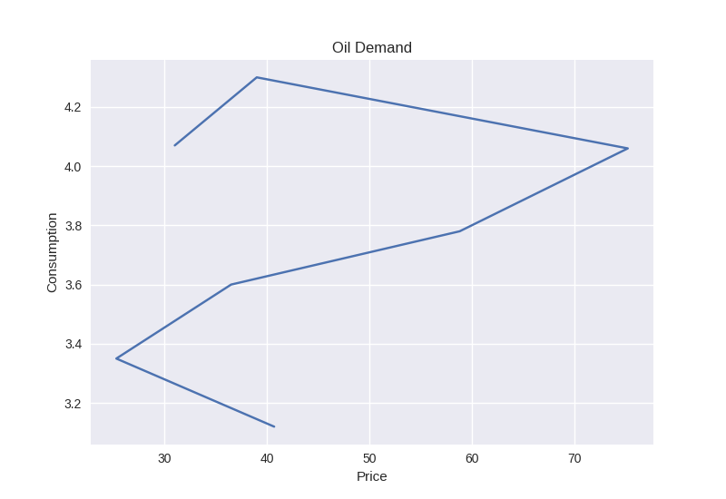

# График мирового спроса на нефть

{ height=256px }

# Эластичность

- Эластичность $= 0.32$
- По графику можно сказать, что рост потребления стабилен и практически не зависит от цены
- Закон убывающей полезности не соблюдается, потому что при снижении цены мы не пронаблюдаем увеличения потребления

# Факторы, влияющие на цену на нефть

- Объемы добычи нефти в Ираке
- Объемы добываемой в США сланцевой нефти
