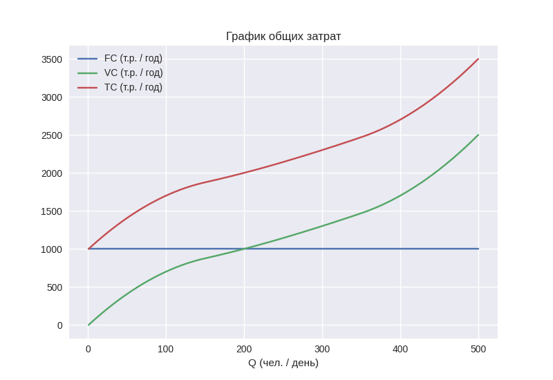
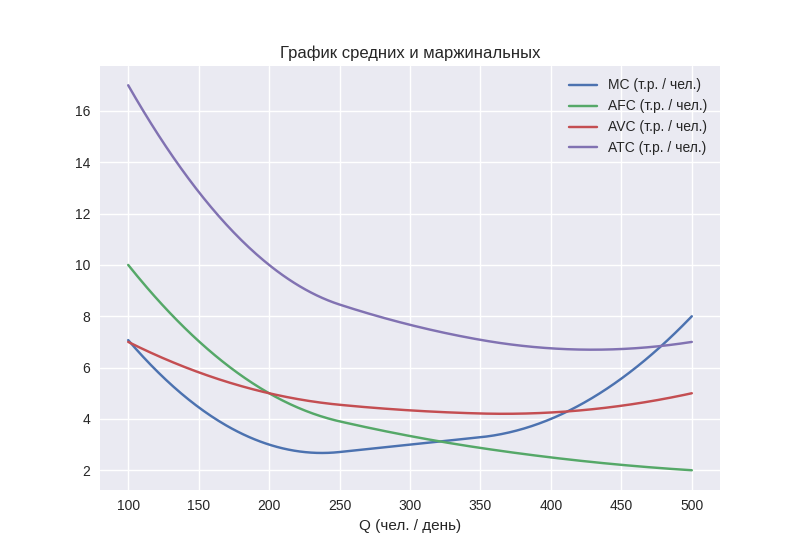

# Примеры издержек

## По влиянию на себестоимость

- прямые: стоимость продуктов
- косвенные: расходы на рекламу

## По отношению к производственному процессу

- производственные: оплата электроэнергии
- непроизводственные: оплата телефонной связи

## По повторяемости

- постоянные (или регулярные): зарплаты сотрудникам
- эпизодические: поломка оборудования
- однократные: закупка оборудования

## По способу учёта

- бухгалтерские: проценты за кредит
- альтернативные: потеря траффика от выбора места

## По способу разнесения

- затраты по подразделениям: затраты менеджмента, затраты рабочего
- затраты по производимым продуктам: затраты на сырье
- затраты по выполняемым функциям: доставка на дом
- релевантные (к данной проблеме, анализу, решению): расширение штата
- нерелевантные: премии сотрудникам
- безвозвратные (утопленные) – sunk costs: оплаченная аренда помещения

\newpage

# Расчет затрат

|   Q (чел. / день) |   FC (т.р. / год) |   VC (т.р. / год) |   TC (т.р. / год) | MC (т.р. / чел.)   | AFC (т.р. / чел.)   | AVC (т.р. / чел.)   | ATC (т.р. / чел.)   |
|------------------:|------------------:|------------------:|------------------:|:-------------------|:--------------------|:--------------------|:--------------------|
|                 1 |              1000 |                 0 |              1000 | -                  | -                   | -                   | -                   |
|               100 |              1000 |               700 |              1700 | 7.071              | 10.0                | 7.0                 | 17.0                |
|               200 |              1000 |              1000 |              2000 | 3.0                | 5.0                 | 5.0                 | 10.0                |
|               300 |              1000 |              1300 |              2300 | 3.0                | 3.333               | 4.333               | 7.666               |
|               400 |              1000 |              1700 |              2700 | 4.0                | 2.5                 | 4.25                | 6.75                |
|               500 |              1000 |              2500 |              3500 | 8.0                | 2.0                 | 5.0                 | 7.0                 |

{ height=250px }

{ height=250px }
